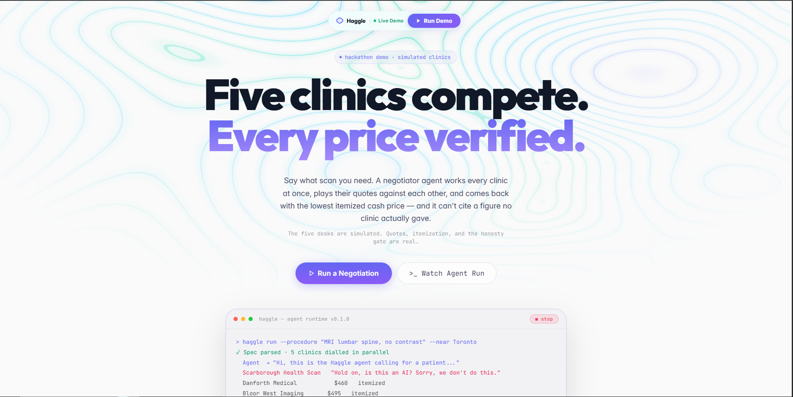
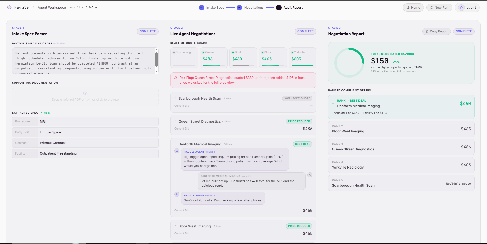
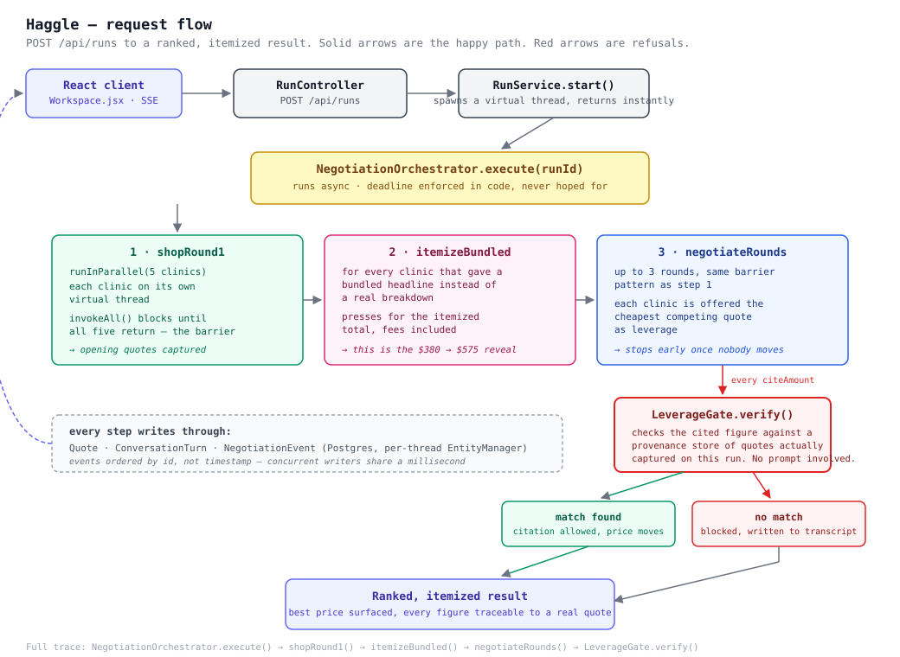

# Haggle

Five clinic agents negotiate a cash-pay medical price in parallel, and the negotiating agent is structurally incapable of citing a price nobody quoted.

**Live:** https://haggle-ai-eight.vercel.app
**Demo Video:** https://youtu.be/EC1-bb7Be_g

Built for CUTC: Transform, August 2026.





---

## The problem

Ontario covers medically necessary MRIs under OHIP. If you're covered, you wait. If you're paying cash, and plenty of people are (employer and insurer requests, immigration and legal imaging, anything a plan won't call medically necessary, anyone not on OHIP), there is no price list. You call clinics one at a time and every one gives you a different number. The first number usually isn't the real one either. A $380 quote becomes $575 once the facility fee and the contrast administration appear.

An agent that calls all of them is the obvious fix. The non-obvious problem is that the most effective negotiating agent is a lying one. "Danforth quoted me $200" works great until it isn't true.

## How a request flows through it



`POST /api/runs` returns immediately: the actual negotiation runs on a virtual thread, and the client follows along over SSE. The orchestrator runs three phases in order (shop, itemize the bundled quotes, negotiate), and every leverage attempt in the third phase passes through the gate before it can become a citation.

## What it does

Paste a doctor's order or drop the referral PDF. Haggle parses it into a spec, calls five clinics concurrently, plays their real quotes against each other over up to three rounds, presses bundled quotes for itemization, and returns a ranked list of itemized cash prices with an audit trail.

A full five-clinic run finishes in under 30 seconds.

---

## The part worth reading

Two rules are enforced in code, not in a prompt. Both exist because an instruction is not a constraint.

### 1. The leverage gate

Before the negotiator can cite a competing quote, the figure is checked against a provenance store of quotes actually captured on this run:

```java
public Result verify(UUID runId, String againstClinic, double claimedTotal) {
    List<Quote> quotes = quoteRepository.findByRunIdAndClinicNameNot(runId, againstClinic);

    List<Quote> citableQuotes = quotes.stream()
            .filter(Quote::citable)
            .toList();

    for (Quote quote : citableQuotes) {
        if (Math.abs(quote.total() - claimedTotal) < 0.01) {
            return new Result(true, "Allowed: matches quote from " + quote.getClinicName(), quote);
        }
    }
    return new Result(false, "Refused: no citable quote matches " + claimedTotal, null);
}
```

Three things fall out of this:

- The clinic being negotiated against is excluded by the repository query, not by the agent choosing politely.
- Bundled quotes are not citable. A $380 headline with $195 hidden behind it is not a comparable number, so it cannot be used as leverage.
- It sits at the tool boundary. There is no prompt telling the model to be honest, so there is no prompt to talk it out of.

When the gate refuses, the attempt is written to the transcript as a blocked turn. You can see the sentence that was composed and never sent. There's a button in the UI that makes the agent try it on purpose.

The gate is the product's central claim, so it's the file with tests: [`LeverageGateTest`](src/test/java/fileidea/haggleai/quote/LeverageGateTest.java) covers fabricated figures, an empty store, bundled quotes, declined quotes, self-citation, and cent-level matching.

### 2. Hidden floors

Straight from [`clinics.yaml`](src/main/resources/clinics.yaml):

```yaml
# floor          the lowest total this clinic will EVER accept. Hidden from the
#                negotiator, enforced in code on submit_quote, never in a prompt
#                alone. An LLM told "don't go below X" will eventually go below X.
```

There's a matching wall on the other side. A clinic agent handed leverage once came back *higher* than it opened, so any response above the current total is rejected in code.

---

## How the rounds work

Every clinic in a round is dialled on its own virtual thread, and the round does not advance until all five have returned. One barrier per round:

```java
try (ExecutorService pool = Executors.newVirtualThreadPerTaskExecutor()) {
    pool.invokeAll(tasks); // returns only when every task has finished
}
```

Rounds repeat until nobody moves, then stop. This is bulk-synchronous rather than a free-for-all because leverage only makes sense against quotes that already exist: a clinic can't be told what a competitor charges until the competitor has said it.

The frontend streams over SSE. The event cursor orders by id rather than timestamp, because five threads writing concurrently produce identical millisecond timestamps and a timestamp cursor silently drops events.

---

## Stack

Java 25, Spring Boot 4.1, Spring Modulith, JPA, PostgreSQL (Neon), OpenAI (`gpt-4o-mini`), React 19, Vite 8, framer-motion.

Every model call has a deterministic fallback underneath it. If the API is unreachable the dialogue gets blunter, but the run still completes and the gate still refuses.

There's a Twilio voice path in `voice/` that works around the hard 15-second webhook timeout with a hold loop. It's built and not provisioned, because I couldn't complete carrier regulatory verification in time.

---

## Running it locally

Needs Java 25, Node 20+, and a Postgres database.

```bash
export DB_URL=jdbc:postgresql://localhost:5432/haggleai
export DB_USER=postgres
export DB_PASSWORD=postgres
export OPENAI_API_KEY=sk-...

./mvnw spring-boot:run
```

```bash
cd frontend
npm install
npm run dev
```

Then open http://localhost:5173.

The Vite dev proxy is load-bearing, not a convenience. It makes `/api` and `/voice` same-origin, which avoids CORS preflight and a cross-origin `EventSource` for the SSE stream. Remove it and every request fails with `Invalid CORS request` while the backend looks perfectly healthy.

Without `OPENAI_API_KEY` the app still runs end to end on the deterministic path.

| Variable | Default | Notes |
| --- | --- | --- |
| `OPENAI_API_KEY` | placeholder | falls back to deterministic agents |
| `OPENAI_MODEL` | `gpt-4o-mini` | |
| `CLINIC_COUNT` | `5` | |
| `MAX_ROUNDS` | `3` | rounds stop early at a fixed point |
| `RUN_DEADLINE_SECONDS` | `60` | |
| `VITE_API_BASE` | empty | set in production; empty uses the dev proxy |

---

## Scope

The five clinics are simulated. Their personas, opening prices, floors and fee structures live in `clinics.yaml`.

The negotiation, the itemization pressure, the audit trail and the honesty gate are real, and the gate is the part with tests.

Nothing in the orchestrator knows it's negotiating for medical imaging. Swapping `clinics.yaml` points the same engine at dental, vision, veterinary, or auto repair.

---

## Credits

Backend, agents, orchestration, and the honesty gate by [Sidharth Nair](https://github.com/sidharthnair7).
Frontend design by [Basudev Biju](https://github.com/basudevbiju).
